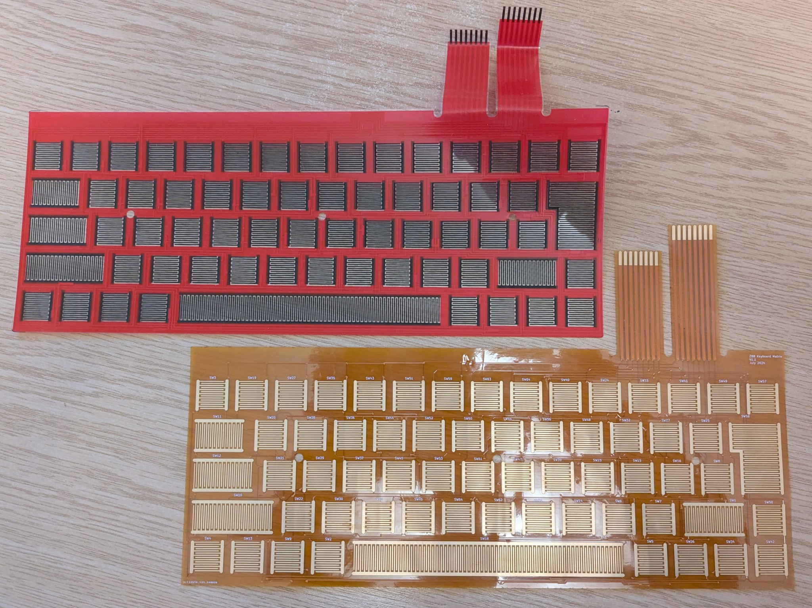

# A new keyboard membrane for the Z88 laptop

The Z88 laptop from 1988 is well out of support. :)
I have a couple of them, and although they're working fine, I've
always been a bit nervous of that keyboard membrane. Membranes on
machines like the ZX Spectrum have a finite life and need replacing
every so often. Would the Z88's keyboard membrane be the same?

I decided to create a new one using a flexi-PCB. I wasn't sure if this
approach would work, but I wanted to find out. So, with considerable
help from my friend Andrew Menadue, I made one. Here it is:

The original is the red one, the new one, as created by JLCPCB, is the
orange one.

The photo is of v1.1, which has the keyboard tails. v1.0 didn't have those,
which was a bit of an oversight. There are no stiffners on the tails. I
didn't know how to create them. It works without stiffners, but
you need to hold the tail right up at the gold fingers and wiggle it into
the connector. Stiffners will be added to v1.2, should I make one.

It works well, sitting perfectly in place under the Z88 rubber mat, and
conducting the carbon under-surface just as expected.

I had mine made from 0.2mm flexi-PCB, which is as thick as JLCPCB can make
them. It could stand being a bit thicker, if possible. It's a little bit
floppy compared to the original one.

[Derek Fountain](https://www.derekfountain.org/), November 2025

# Acknowledgements

[Andrew Menadue](http://trochilidae.blogspot.com/) for doing the clever
KiCAD footprint thing and the original layout of the keys.
